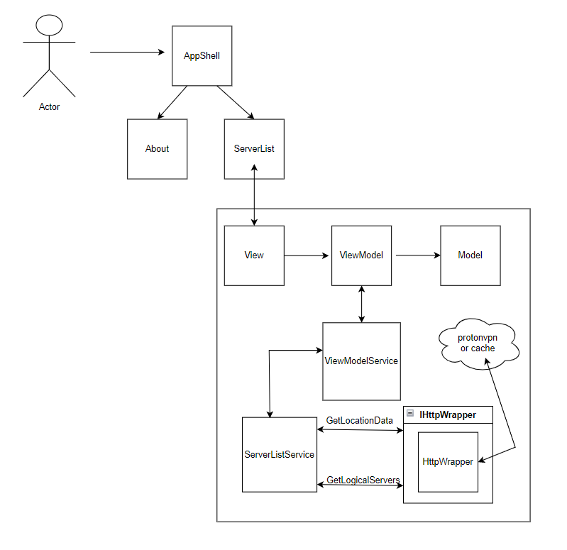

# About
**ServerList** is a .NET application that was built to complete the Proton coding exercise.

# ServerList

The purpose of this app is to retrieve basic location information and list of servers
from a RESTful API and present that information in the window. Data is downloaded
automatically at app start and refreshed on request by the user. The app is able to
fall back on a cache in case the API is unavailable.

## Planning
To assist with planning the task, I setup a [GitHub Project board](https://github.com/users/grahamrgriffiths/projects/2). Usually, I would use Trello - but I've been meaning to try [projects](https://docs.github.com/en/issues/planning-and-tracking-with-projects/learning-about-projects/about-projects)

## Expanding the application
An intern had left behind this piece of code. The task was to refactor it as much as possible into clean 
code according to best practices and fix the bugs and missing functionalities.

The following was fixed:
- The app occasionally crashes when scrolling servers down or refreshing.
- The window layout becomes ugly when resizing.
- The Current location displays nothing.
- The servers should be listed by the distance from the current location in an ascending 
order.

### Architecture
I chose the approach of updating the application to use [.NET MAUI](https://learn.microsoft.com/en-us/dotnet/maui/what-is-maui) and .NET 6

The MVVM pattern has been implemented, along with using services for each view model.

Dependency injection and core logging concepts have also been introudced.

Async APIs have been used where available, to support a non-blocking UI.

Unit tests have been implemented for the service logic only.



## Running the application
To run the application locally, ensure you are in the directory 'src\ServerList'

First, restore the dependencies.
```
dotnet restore
```

Second, build the project,
```
dotnet build
```

Finally, run the project. Ensure that you use a framework that you have installed.
```
dotnet run --project .\ServerList\ServerList.csproj --framework net6.0-windows10.0.19041.0
```

## Testing the application
Partial test coverage has been introduced for the http wrapper and the view model service logic.
To test the application locally, ensure you are in the directory 'src\ServerList'

Run the tests
```
dotnet test
```

Generate a test report (with coverage)
```
dotnet test --settings ../../settings/coverlet-run.xml --logger trx --results-directory "reports"
```

## CI 
A CI pipeline has been implemented for this task using Github Actions.

The pipeline has the following workflows:
- ServerList CI
    - Builds the application.
    - Tests the application. 
        - Generates a report, with coverage.

[](https://github.com/grahamrgriffiths/protoncodingtest/actions/workflows/ServerList.yml)

## Author
[Graham Griffiths](https://github.com/grahamrgriffiths)
